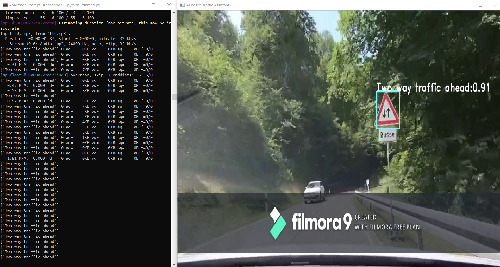

# Real-time-traffic-sign-detection-and-classification-with-voice-feedback

With the increase in number of road accidents happening every year, there has been a need to develop a system that contributes to the safety of the drivers, pedestrians and vehicles. Traffic sign detection and recognition plays an integral role for driver assistant system as well as autonomous driving vehicles.

In this project, an approach to assist the driver through traffic sign recognition with much more faster detection in conjunction with human-like general voice feedback has been presented.

<h2>Index</h2> 

<ol>
  <li>Installation</li>
  <li>Dataset</li>
  <li>Working</li>
  <li>Resutls</li>
</ol>

  
<h2> Installation </h2>

  
<h2> Dataset </h2>

 As our Meta data is mostly focusing on German Traffic signs, videos related to same are collected. As the video collected is raw, some processing has to be performed in order to obtain clean dataset. 

<h4> Meta Data (Classes) </h4>

 During the pre-processing, the part of the video that does not contain traffic sign is trimmed as it may add to the noisy data. After the entire video is trimmed, the frames are obtained at the rate 10 frames per second and each frame is saved as a jpeg file. 

<h4> Dataset Distribution according to classes </h4>

<h4> Classes </h4>

  
<h2> Working </h2>

  
<h2> Result </h2>

