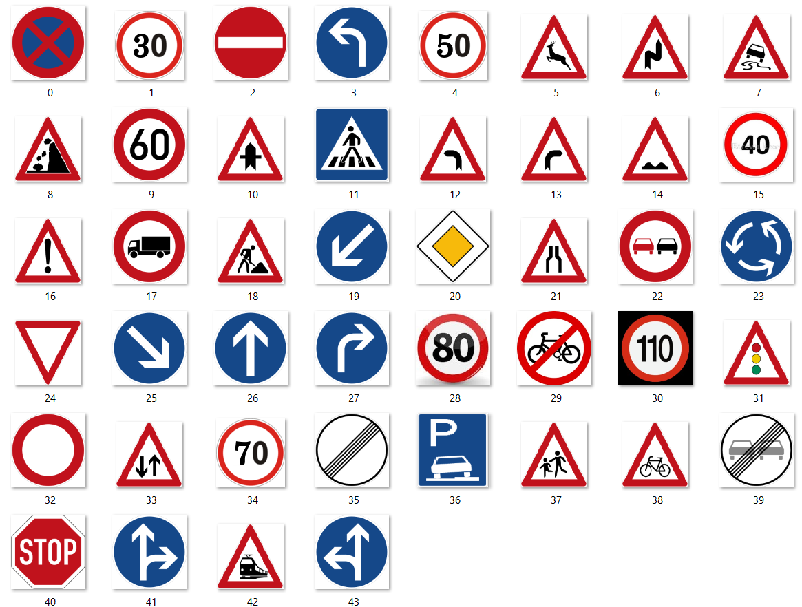

# Real-time-traffic-sign-detection-and-classification-with-voice-feedback

<p>With the increase in number of road accidents happening every year, there has been a need to develop a system that contributes to the safety of the drivers, pedestrians and vehicles. Traffic sign detection and recognition plays an integral role for driver assistant system as well as autonomous driving vehicles.</p>
<p>In this project, an approach to assist the driver through traffic sign recognition with much more faster detection in conjunction with human-like general voice feedback has been presented.</p>
<hr>

<h2>Index</h2> 

<ol>
  <li>Installation</li>
  <li>Dataset</li>
  <li>Working</li>
  <li>Resutls</li>
</ol>
<hr>
<br><br>
<h2> Installation </h2>
<hr>
<br><br>
<h2> Dataset </h2>
<p> As our Meta data is mostly focusing on German Traffic signs, videos related to same are collected. As the video collected is raw, some processing has to be performed in order to obtain clean dataset. </p>

<h4> Meta Data (Classes) </h4>


<p> During the pre-processing, the part of the video that does not contain traffic sign is trimmed as it may add to the noisy data. After the entire video is trimmed, the frames are obtained at the rate 10 frames per second and each frame is saved as a jpeg file. Classes names are the found in obj.names file in the repository</p>

<h4> Dataset Distribution according to classes </h4>


<hr>
<br><br>
<h2> Working </h2>

<p>To accomplish this we used a tool OpenLabelling written in Python to draw bounding box for each traffic sign. YOLOv2 requires annotation text in XML file format while YOLOv3 requires the same in TXT file format.
39
So, this tool generates a txt file for every image. The format of storing the annotation data in the
txt file is as follows:</p>
```

[class_id] [x] [y] [width] [height]
Where:
- [class_id] : integer number of object class from 0 to (classes-1)
- [x] [y] [width] [height] : float values according to width and height of image, it ranges from
0.0 to 1.0
- [x] [y] : is the centre of rectangle (are not top-left corner).

```

<p>YOLOv3 makes prediction on the basis of darknet-53 at 3 different scales. Each location is being predicted 3 times by YOLOv3. Each prediction takes into account a boundary box, an object score and 44 class scores, i.e. N × N × [3 × (4 + 1 + 44)] predictions. Each block displays the following things that is the type of layer, the stride, number of filters and filter size. This means, with an input of 416 x 416, we make detections on scales 13 x 13, 26 x 26 and 52 x 52. Each cell predicts 3 bounding boxes using 3 anchors at each scale which makes the total number of anchors used as 9 (The anchors are different for different scales). 

An image may contain many objects and each object is related with one grid cell. YOLO can work well in such situations where overlapping of centre points of two objects can occur. To allow a grid cell to detect multiple objects, YOLO uses anchor boxes [2]. With the help of anchor boxes, a longer grid cell vector is created and multiple classes with each grid cell can be associated. Anchor boxes have a defined aspect ratio with which they try to detect objects that properly fit into a box with the defined ratio
</p>

<hr>
<br><br>
<h2> Result </h2>


